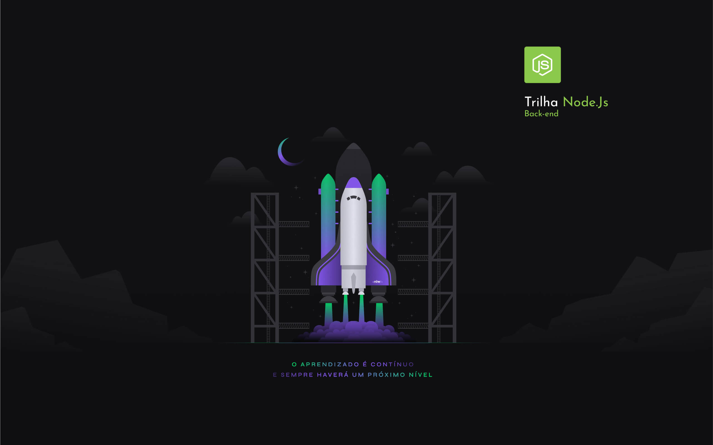

<p>
  
  
  
  <a href="https://opensource.org/licenses/MIT">
    
  </a>
  <a href="https://github.com/FelipeCostaAraujo/nlw-nodejs-edicao4/commits/main">
    
  </a>
</p>

# O projeto

Durante esta **Next Level Week** foi desenvolvida uma API Restful para Net Promoter Score.

> O **Net Promoter Score** é uma metodologia de satisfação de clientes desenvolvida para avaliar o grau de **fidelidade dos clientes** de qualquer perfil de empresa.

Foram feitas algumas melhorias e adições no projeto.
- autenticação usando jwt.
- proteção de rota.
- docker.

# Iniciando a jornada

Se você estiver iniciando a jornada e não tem muita familiariadade com alguns conceitos, esse guia definitivamente irá lhe ajudar: [Guia Next Level Week #4](https://www.notion.so/Next-Level-Week-4-Node-js-67981103adbb4f229187c802bcd0d787)

# Sobre

As aulas foram ministradas pela **[Daniele Leão](https://github.com/danileao)** instrutora da [Rocketseat](https://rocketseat.com.br/)


## Installation and use

```sh
$ cd nlw-nodejs-edicao4
$ yarn install
```

**Creating environment variables**
```sh
$ mkdir .env
$ cd .env
$ touch production
$ touch testing
```

**Example .env file**
```file
INFO = STRING
PORT = INT
SALT_KEY = UUID
HOST = STRING
POSTGRESS_PORT = INT
USERNAME = STRING
PASSWORD = STRING
DATABASE = STRING
```

**Create image POSTGRES**
```sh
$ docker-compose build
$ docker-compose up -d
```

**Run production DATABASE**
```sh
$ yarn start
```

**Run Development DATABASE**
```sh
$ yarn dev
```
**Run migrations**
```sh
$ yarn typeorm migration:run
```

**Create migrations**
```sh
$ yarn typeorm migration:create -n MigrateName
```

**Run migrations rollback**
```sh
$ yarn knex:migration:revert
```

**Run tests**
```sh
$ yarn test
```

<br>

<div align="center">
    
</div>

<br>

##  Info:
- Author - Felipe Araujo:
- Date - February/2021: